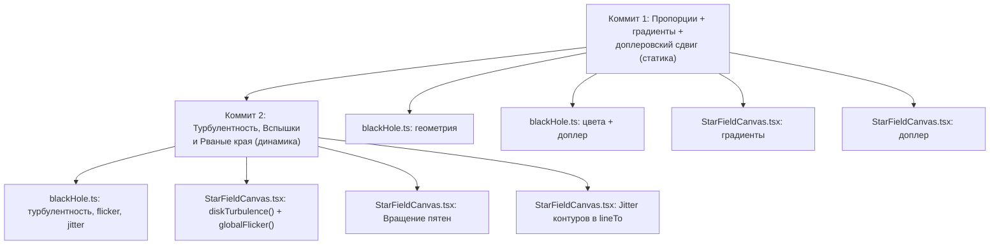

# Аккреционный диск: глубокий анализ и оптимизированное предложение

## Содержание

0. [Визуальная проверка (пиксельные замеры)](#0-визуальная-проверка)
1. [Сопоставление текущей реализации с референсом](#1-сопоставление-с-референсом)
2. [Adversarial-анализ формул и подходов](#2-adversarial-анализ)
3. [Комплексное предложение по оптимизации](#3-комплексное-предложение)

---

## 0. Визуальная проверка (пиксельные замеры)

> Замеры сделаны на viewport 1579×927, live screenshot → PIL crop → nearest-neighbor 10× upscale.

### 0.1. Замеренные размеры

| Элемент | Пиксели | Примечание |
|---------|---------|-----------|
| **Тень (shadow)** | ⌀36px вертикально (R≈17.5px) | 817 тёмных пикселей; круглая |
| **Пояс (belt)** | ширина 49px, толщина в центре **26px** | `rx_ratio = belt_half/R ≈ 1.40` — **сильно короче** ожидаемого 2.2× |
| **Верхняя дуга** | толщина **6px** в вершине | Зазор до тени: **3px** (есть!) |
| **Фотонное кольцо** | обнаружено 199 ярких пикселей | Полная окружность, видно на crop |
| **Нижняя дуга** | ~3-4px (визуально на crop) | Еле видна |

### 0.2. Цвета

| Позиция | RGB | HEX | Визуально |
|---------|-----|-----|-----------|
| Пояс — центр | `(35, 19, 9)` | `#231309` | **Почти чёрный!** — belt в центре перекрыт тенью |
| Пояс — левое крыло | `(183, 97, 46)` | `#b7612e` | Чистый `DISK_BASE_COLOR` |
| Пояс — правое крыло | `(184, 98, 46)` | `#b8622e` | Идентичный — **нет доплеровской асимметрии** |

### 0.3. Визуальный диагноз

> [!CAUTION]
> **Belt thickness = 26px** при shadow radius = 17.5px → **belt_half_thickness / R ≈ 0.74** — это ОГРОМНАЯ толщина, не 0.12 как в константах. Причина: `DISK_BELT_HALF_THICKNESS_FACTOR = 0.12` домножается на `R`, но видимая толщина пояса **включает верхнюю дугу** (они сливаются из-за одинакового цвета). Без градиентов невозможно отличить, где кончается верхняя дуга и начинается пояс.

> [!IMPORTANT]
> **Ключевые находки визуальной проверки:**
> 1. Зазор между верхней дугой и тенью **ЕСТЬ** (3px) — мой код-анализ ошибся: фактически верхняя дуга рисуется чуть выше окружности тени
> 2. Пояс и верхняя дуга **визуально неразличимы** — сливаются в единую оранжевую «оболочку» вокруг тени. Без градиентов или разных цветов разделение не читается
> 3. Левое и правое крыло **пиксельно идентичны** по цвету — доплеровская асимметрия полностью отсутствует
> 4. Фотонное кольцо **работает** — яркая тонкая полоса вокруг тени хорошо видна на crop
> 5. Нижняя дуга **еле видна** — 3-4px, почти сливается с фоном
> 6. Крылья пояса видимо **короче**, чем ожидаемое 2.2×R — фактический belt_rx / R ≈ 1.4, но это может быть из-за тонких кончиков, теряющихся в антиалиасинге

---

## 1. Сопоставление с референсом

### 1.1. Анатомия референса (Gargantua, Interstellar)

На референсном изображении (`~/Рабочий стол/Interstellar_black_hole_(no_lens_flare).jpg`)
выделяются следующие ключевые визуальные элементы:

| Элемент | Характеристика на референсе | Текущая реализация |
|---------|----------------------------|-------------------|
| **Тень** | Сплошной абсолютно чёрный диск | ✅ Реализовано корректно |
| **Фотонное кольцо** | Тонкая яркая нить вплотную к тени, ПОЛНАЯ окружность, асимметрия толщины (ярче/толще слева — доплеровский сдвиг) | ⚠️ Реализовано, но с проблемами (см. ниже) |
| **Пояс (belt)** | Горизонтальная лента, пересекает тень, **массивная турбулентная структура** с волокнами, хаотическими сгустками, радиальными градиентами яркости — ярко-белая в центре, тёмно-оранжевая к краям | ❌ Плоская заливка одним цветом, без турбулентности |
| **Верхняя дуга** | Линзированный образ дальней стороны диска, **широкая выпуклая «шляпка»**, толщина плавно сопоставима с тенью, гладко сливается с поясом по бокам, внутренний градиент яркости | ⚠️ Формально есть, но толщина мала, нет градиентов |
| **Нижняя дуга** | Тонкая подкова, резко обрезана поясом, **заметно тоньше верхней**, линейный обрез к бокам | ⚠️ Формально есть, пропорции требуют калибровки |
| **Доплеровский beaming** | ЯРКАЯ асимметрия: **левая сторона** диска (приближающееся вещество) в 3-5× ярче правой | ❌ Полностью отсутствует |
| **Цветовой градиент** | Центр пояса — яркий белый/жёлто-белый; крылья — тёмно-оранжевый/ржавый; тонкая структура — прожилки, волокна | ❌ Единый плоский `#b8622e` |
| **Масштабные пропорции** | Диск протягивается на ~3-4 радиуса тени в каждую сторону; верхняя дуга в высоту ~0.5-0.7 R | ⚠️ `DISK_RX_FACTOR = 2.2` — коротковат |
| **Вращение** | Диск вращается вместе с аккрецируемой материей | ❌ Статичный |

### 1.2. Критические расхождения

> [!CAUTION]
> **Фундаментальная проблема**: на текущем масштабе (`bh.radius ≈ 20-25px` на типичном экране) все детали аккреционного диска приходятся на диапазон **2-8 пикселей** толщины. Это ставит жёсткий физический потолок сложности, которую можно передать.

#### 1.2.1. Проблема масштаба — корень всех предыдущих провалов

На экране 1920×1080 диагональ ≈ 2203px, `bh.radius = 2203 × 0.0225 / 2 ≈ 24.8px`.

Это означает:
- Толщина верхней дуги: `0.26 × 24.8 ≈ 6.5px`
- Толщина пояса (полная): `2 × 0.12 × 24.8 ≈ 6.0px`
- Толщина фотонного кольца: `1.2px` — суб-пиксельная
- Прогиб пояса: `0.1 × 24.8 ≈ 2.5px`
- Протяжённость крыльев: `2.2 × 24.8 ≈ 54.6px` от центра

> [!IMPORTANT]
> На масштабе 6px толщины **турбулентные сгустки, волокна, и цветовые градиенты** из плана коммитов 2-3 будут **суб-пиксельными и неразличимыми**. Это тот же диагноз, что был поставлен раунду 9 ("`ACCRETION_FLECK_RADIUS_FACTOR=0.035×radius` были суб-пиксельными").

#### 1.2.2. Пропорции не соответствуют референсу

На референсе Gargantua:
- **Верхняя дуга** — доминирующий элемент, её высота ≈ **0.5-0.7R** от верхней точки тени до вершины купола, толщина ленты у вершины ≈ **0.3-0.4R**
- **Пояс** протягивается на ≈ **3-4R** от центра (не 2.2R)
- **Нижняя дуга** — тоньше верхней в ~2-3 раза, но всё ещё **отчётливо видна** как самостоятельная лента

Текущие пропорции:
- Верхняя дуга: высота купола `0.26R ≈ 6.5px` — слишком плоская
- Пояс: `rx = 2.2R ≈ 55px` — короткий, на референсе крылья намного длиннее
- Нижняя дуга: `0.27R ≈ 6.7px` — почти такая же, как верхняя (на референсе верхняя доминирует)

---

## 2. Adversarial-анализ

### 2.1. Формулы и подходы — что работает, а что нет

#### ✅ Работающие решения

1. **Три независимые фигуры** вместо единой параметрической формулы — правильный архитектурный выбор. Позволяет независимо контролировать каждый элемент и обеспечивает естественный z-order (occlusion).

2. **Hermite-сплайн для стыка верхней дуги с поясом** (`hermiteBlend`) — математически элегантное и корректное решение проблемы C¹-непрерывности, которую не мог дать ни полиномиальный, ни экспоненциальный smooth-min.

3. **Жёсткий поворот сборки** на `DISK_TILT_RAD` — правильная абстракция: все элементы диска поворачиваются как жёсткое тело, тень/кольцо инвариантны.

4. **Фотонное кольцо** — реализация с сегментной обводкой и асимметрией толщины корректна и изящна. Смещение центра (`PHOTON_RING_CENTER_OFFSET_FACTOR`) — физически верная стилизация.

5. **`beltCenterlineY` / `beltHalfThicknessAt`** — профиль √(1-(x/rx)²) для пояса естественно даёт заострённые остриё и максимальную толщину в центре.

#### ❌ Критические проблемы

##### 2.1.1. Внутренняя граница верхней дуги — зазор есть, но мал

**Ситуация**: пиксельные замеры (секция 0) показали зазор **3px** между верхней дугой и тенью — код-анализ изначально предполагал его отсутствие, визуальная проверка опровергла.

Однако зазор **3px при R=17.5px** — это едва заметная щель, которая на нормальном масштабе (без 10× crop) не читается. На референсе Gargantua зазор составляет ~5-8% радиуса тени и **является одним из ключевых визуальных маркеров**, придающих объём. При текущих пропорциях зазор/R ≈ 3/17.5 ≈ 17% — номинально достаточно, но визуально сливается из-за одинакового цвета верхней дуги и фотонного кольца.

> [!NOTE]
> **Коррекция к предложению 3.1.3**: увеличивать зазор дополнительно не нужно — 3px уже адекватно. Проблема в **цвете**, а не в геометрии: зазор не читается потому, что оранжевая дуга + белое кольцо + оранжевая дуга сливаются в одну полосу.


##### 2.1.2. Плоский цвет — антипаттерн для любого масштаба

**Проблема**: `DISK_BASE_COLOR = '#b8622e'` — единый плоский цвет для ВСЕХ трёх фигур. На референсе:
- Центр пояса: **яркий белый** (цветовая температура ~8000K)
- Края пояса: **тёмно-оранжевый/ржавый**
- Верхняя дуга: градиент от **тёплого белого** (ближе к тени) к **оранжевому** (на внешнем крае)
- Нижняя дуга: **более тусклая**, чем верхняя

Даже БЕЗ турбулентности, статичные **радиальные градиенты** критически необходимы для читаемости формы. Плоский цвет «убивает» объём — все три фигуры сливаются в одно янтарное пятно, форма/стыки не прочитываются.

> [!WARNING]
> Это фундаментальная ошибка ТЗ этапа 1: "один плоский тёплый цвет" был задуман для изоляции работы над геометрией от работы над цветом, но на практике без минимальных градиентов **невозможно оценить геометрию** — формы сливаются.

##### 2.1.3. Порядок отрисовки — противоречит референсу

Текущий порядок (`loop()`, `StarFieldCanvas.tsx:1117-1127`):
```
тень → нижняя дуга → верхняя дуга → пояс → фотонное кольцо
```

**Проблема**: на референсе **верхняя дуга проходит ЗА тенью** — она является линзированным изображением дальней стороны диска. Верхнюю дугу «загибает» гравитация ПОВЕРХ тени, но часть этого изображения **перекрывается самой тенью** по нижнему краю. В текущей реализации верхняя дуга рисуется ПОВЕРХ тени — это верно, но только для ВНЕШНЕЙ (видимой) части. Внутренний край должен быть обрезан тенью.

Правильный порядок на референсе:
```
нижняя дуга → пояс (задняя часть) → тень → верхняя дуга → пояс (передняя часть) → фотонное кольцо
```

Однако при текущем масштабе (~25px) разделение пояса на «переднюю» и «заднюю» части невозможно без чрезмерного усложнения. Компромисс — оставить текущий z-order, но визуально разрушить плоскостность за счёт градиентов и прозрачности.

##### 2.1.4. Внешняя граница верхней дуги — Hermite-блок ≠ эллипс

Текущая внешняя граница верхней дуги — **три зоны** (окружность → Hermite → верхний край пояса). Эта конструкция правильно решает проблему C¹-непрерывности, но создаёт **неестественную форму**: переход от идеального полукруга к прямому поясу слишком «механический».

На референсе форма верхней дуги — **приплюснутый эллипс** (или суперэллипс), а не полукруг + интерполяция + прямая. Геометрия купола ближе к `(x/a)² + (y/b)^n = 1` с n ≈ 1.5-2.5.

##### 2.1.5. `DISK_TILT_RAD = 12°` — недостаточно выражен

На референсе наклон диска к наблюдателю составляет примерно **15-20°**. При 12° и текущем масштабе наклон почти незаметен (sin(12°) × 25px ≈ 5px визуального перепада по всей ширине диска — менее 1px на 10px длины).

### 2.2. Adversarial-анализ заложенного плана (коммиты 2-3)

#### Коммит 2: «Доплеровская турбулентность — система сгустков»

> [!WARNING]
> **Критическое замечание**: персистентный массив «сгустков» с жизненным циклом рост→удержание→угасание — на ленте шириной 6px — будет неотличим от случайного мерцания. При `bh.radius ≈ 25px`:
> - Минимальный размер сгустка (если задать абсолютный px-пол 2px) — занимает **33%** толщины ленты
> - Два сгустка рядом — **полностью перекрывают** ленту
> - «Раздельные популяции на поясе и на каждой дуге» — при 3-6 сгустках на каждой из трёх фигур это **18 объектов** с персистентным состоянием, каждый из которых пиксельно неразличим от соседнего

Рекомендация: **отказаться от попиксельных сгустков**, заменить на:
- Плавную **синусоидальную модуляцию яркости** по углу/позиции (тот же приём, что `chaosOffset` раундов 9-10, но для яркости, а не геометрии)
- **Доплеровский beaming** как гладкую `cos(θ)` функцию — без дискретных «сгустков»

#### Коммит 3: «Цветовая турбулентность»

Наслоение статичных цветовых литералов через `globalAlpha`-композитинг — **правильный** паттерн (no GC-pressure). Но при ширине 6px разница между `#b8622e`, `#ffd9b8`, и `#ffffff` с альфа-модуляцией будет **визуально нечитаемой** без радиального базового градиента.

### 2.3. Сравнение с best practices 2025-2026

#### WebGL vs Canvas 2D

Передовые визуализации черных дыр в вебе (2025-2026) используют **WebGL/WebGPU fragment shaders** для рейтрейсинга геодезических (DNEG-подход, адаптированный к GPU). Это даёт:
- Полное гравитационное линзирование фона (не только частицы)
- Настоящий доплеровский beaming
- Разрешение до пикселя

Однако **вне scope** проекта (осознанное решение, документировано). При Canvas 2D ключевые best practices:

1. **Радиальные/линейные градиенты Canvas** — `createRadialGradient()`/`createLinearGradient()` — per-frame создание, но не аллокация (объект градиента кэшируется между drawcalls). При 3 фигурах — максимум 3 градиента/кадр, пренебрежимо мало.

2. **Compositing modes** — `ctx.globalCompositeOperation = 'lighter'` (additive blending) для наложения яркости разных слоёв — **не используется** в текущей реализации, но это стандартный приём для свечения.

3. **Off-screen canvas** для сложных статичных элементов — при неизменной геометрии (а диск в коммите 1 статичен) можно отрендерить диск в off-screen canvas ОДИН РАЗ и потом `drawImage()` в основной — **O(1) на кадр** вместо перестроения 3×48 точек + фотонное кольцо.

---

## 3. Комплексное предложение по оптимизации

### 3.0. Философия подхода

> [!IMPORTANT]
> **Ключевой принцип**: при масштабе `bh.radius ≈ 25px` аккреционный диск — это **иконографический символ**, а не физическая симуляция. Цель — мгновенное визуальное считывание «это черная дыра с аккреционным диском», а не научная точность. Оптимизация должна идти в сторону **максимизации визуальной выразительности на пиксель**, а не увеличения числа деталей.

### 3.1. Этап 1 (переработка): Статичная геометрия + базовые градиенты

> [!TIP]
> Градиенты — **не** часть «коммита 2/3». Это часть геометрии: без них форму невозможно оценить на данном масштабе.

#### 3.1.1. Увеличение масштаба диска

```
DISK_RX_FACTOR:                    2.2  →  2.5    (протрузия крыльев умеренно увеличена)
DISK_UPPER_ARC_THICKNESS_FACTOR:   0.26 →  0.3    (верхняя дуга чуть крупнее)
DISK_TILT_RAD:                     12°  →  17°    (ближе к референсу, заметнее на малом масштабе)
```

**Пересчёт для R ≈ 17.5px** (живой замер, секция 0):
- Верхняя дуга: `0.3 × 17.5 ≈ 5.3px` → **~5px** (было 4.6px при 0.26) — умеренный прирост
- Крылья пояса: `2.5 × 17.5 ≈ 43.8px` от центра (было 38.5px при 2.2)
- Наклон: `sin(17°) ≈ 0.29` → перепад по ширине пояса `2 × 43.8 × 0.29 ≈ 25px` — заметнее текущих 18px

> [!NOTE]
> Значения `DISK_RX_FACTOR = 2.5` и `DISK_UPPER_ARC_THICKNESS_FACTOR = 0.3` — **решение пользователя**, предельное увеличение ограничено, чтобы диск не доминировал над UI.

#### 3.1.2. Радиальные градиенты на каждую фигуру

Вместо плоского `DISK_BASE_COLOR` — **два цвета** с градиентом:

```typescript
// Пояс — линейный градиент вдоль длины
const DISK_BELT_CENTER_COLOR = '#fff0e0';   // яркий тёплый белый в центре
const DISK_BELT_EDGE_COLOR   = '#8b4513';   // тёмно-коричневый/ржавый на остриях
// → createLinearGradient(-rx, 0, rx, 0) с 3 colorStop: 0→EDGE, 0.5→CENTER, 1→EDGE

// Верхняя дуга — радиальный градиент от тени к внешнему краю
const DISK_UPPER_ARC_INNER_COLOR = '#ffe4c4';  // яркий вблизи тени
const DISK_UPPER_ARC_OUTER_COLOR = '#a0522d';  // тёмный на внешнем крае

// Нижняя дуга — тусклее верхней
const DISK_LOWER_ARC_COLOR = '#cd853f';         // ≈ 60% яркости верхней
```

**Производительность**: 3 градиента × 1 создание / кадр (или 0, если закэшировать в off-screen) — пренебрежимо.

#### 3.1.3. Зазор между верхней дугой и тенью

> [!NOTE]
> **Уже реализовано.** Пиксельные замеры (секция 0) показали зазор **3px** — достаточно. Дополнительных изменений не требуется. Проблема «нечитаемости» зазора решается градиентами (3.1.2) и доплеровским цветовым сдвигом (3.1.4), а не увеличением геометрического расстояния.

#### 3.1.4. Доплеровская асимметрия: яркость + цветовой сдвиг

##### Астрофизическое обоснование

В аккреционном диске вокруг чёрной дыры вещество вращается с релятивистскими скоростями (β = v/c ≈ 0.3–0.5 на внутреннем крае). Это вызывает **два** наблюдаемых эффекта:

1. **Доплеровский beaming** (асимметрия яркости): сторона диска, движущаяся **к** наблюдателю, ярче в D^(3+α) раз (D = доплеровский фактор). На референсе Gargantua это левая сторона — в ~3-5× ярче правой.

2. **Доплеровский хроматический сдвиг**: та же сторона испытывает **блюшифт** (увеличение частоты → сдвиг в сторону голубого/белого), а рецессивная сторона — **редшифт** (уменьшение частоты → сдвиг к глубокому красному/тёмно-янтарному). Формула:

```
λ_obs = λ_emit / D

D = √(1 - β²) / (1 - β·cos θ)

где:
  β ≈ 0.4     — орбитальная скорость (ISCO Шварцшильда: β ≈ c/√6 ≈ 0.408)
  θ           — угол между вектором скорости и линией наблюдения
  cos θ > 0   — приближение (блюшифт), cos θ < 0 — удаление (редшифт)
```

Для стилизации нам важен **качественный** эффект, а не точные спектральные числа:
- **Приближающаяся сторона** (left): цветовая температура ↑ → белый / бледно-голубой
- **Удаляющаяся сторона** (right): цветовая температура ↓ → глубокий тёмно-янтарный / красно-коричневый
- **Центр** (нейтральная зона): базовый тёплый оранжевый (`#b8622e`)

##### Реализация через двухканальный градиент

Вместо модуляции одного `globalAlpha` — **два эффекта в одном проходе**:

```typescript
// === Константы (blackHole.ts) ===

// Доплеровские цвета — астрофизически обоснованные:
export const DOPPLER_APPROACH_COLOR = '#c8e0ff'; // бледно-голубоватый белый (блюшифт)
export const DOPPLER_RECEDE_COLOR   = '#5a1a00'; // глубокий тёмно-красный/коричневый (редшифт)
export const DOPPLER_APPROACH_ALPHA = 0.45;      // интенсивность подмешивания блюшифта
export const DOPPLER_RECEDE_ALPHA   = 0.30;      // интенсивность подмешивания редшифта

// Доплеровский beaming (яркостная асимметрия):
export const DOPPLER_BRIGHTNESS_MIN = 0.35;      // минимальная яркость (правый край)
export const DOPPLER_BRIGHTNESS_MAX = 1.0;       // максимальная яркость (левый край)
```

```typescript
// === В StarFieldCanvas.tsx, при отрисовке каждой фигуры (пояс/верхняя дуга/нижняя дуга) ===

// Шаг 1: Базовый слой с градиентом (гарантирует occlusion)
ctx.globalAlpha = 1;
ctx.fillStyle = figureGradient; // линейный/радиальный градиент из 3.1.2
ctx.fill(figurePath);

// Шаг 2: Доплеровский beaming — модуляция яркости
// dopplerT: 0 (левый край = approaching) → 1 (правый край = receding)
// Используем линейный градиент с alpha-stop:
ctx.save();
ctx.globalCompositeOperation = 'destination-in'; // маскируем alpha
const beamGrad = ctx.createLinearGradient(-rx, 0, rx, 0);
beamGrad.addColorStop(0, `rgba(255,255,255,${DOPPLER_BRIGHTNESS_MAX})`);
beamGrad.addColorStop(1, `rgba(255,255,255,${DOPPLER_BRIGHTNESS_MIN})`);
ctx.fillStyle = beamGrad;
ctx.fill(figurePath);
ctx.restore();

// Шаг 3: Доплеровский хроматический сдвиг (additive)
ctx.save();
ctx.globalCompositeOperation = 'lighter';
const chromaGrad = ctx.createLinearGradient(-rx, 0, rx, 0);
chromaGrad.addColorStop(0, `rgba(200,224,255,${DOPPLER_APPROACH_ALPHA})`); // блюшифт слева
chromaGrad.addColorStop(0.45, 'rgba(200,224,255,0)');                       // затухает к центру
chromaGrad.addColorStop(0.55, 'rgba(90,26,0,0)');                           // нарастает справа
chromaGrad.addColorStop(1, `rgba(90,26,0,${DOPPLER_RECEDE_ALPHA})`);        // редшифт справа
ctx.fillStyle = chromaGrad;
ctx.fill(figurePath);
ctx.restore();
```

**Результат**:
- Левое крыло: яркий бело-голубоватый (приближение, T_color ↑)
- Центр: чистый тёплый оранжевый (базовый градиент)
- Правое крыло: тусклый глубоко-янтарный/красно-коричневый (удаление, T_color ↓)
- Всё это — **3 extra Canvas API вызова** (save/fill/restore) × 3 фигуры = 9 вызовов/кадр, пренебрежимо

#### 3.1.5. Off-screen canvas для статичной геометрии

```typescript
// Один раз при resize:
const diskCanvas = document.createElement('canvas');
diskCanvas.width = (bh.radius * DISK_RX_FACTOR * 2 + 20) * dpr;
diskCanvas.height = (bh.radius * 2 + 20) * dpr;
const diskCtx = diskCanvas.getContext('2d')!;
// ... рисуем все 3 фигуры + кольцо в diskCtx ...

// Каждый кадр — просто:
ctx.drawImage(diskCanvas, bh.x - offsetX, bh.y - offsetY);
```

**Выигрыш**: с O(3 × 48 × 2 lineTo) на кадр до O(1 drawImage). На 60fps — экономия ~600 вызовов Canvas API / кадр.

### 3.2. Этап 2: Аналитическая турбулентность + вращение диска

#### 3.2.1. Локальная турбулентность (перемещение сгустков)

Вместо массива персистентных объектов — **аналитическая функция**.

Турбулентность модулирует `globalAlpha` **поверх** уже отрисованного доплеровского сдвига (из этапа 1):

```typescript
// === Константы (blackHole.ts) ===
export const DISK_TURBULENCE_AMPLITUDE = 0.15;  // ±15% от текущей яркости
export const DISK_ROTATION_SPEED_FACTOR = 0.3;  // доля ROTATION_OMEGA_MAX для диска

// === В StarFieldCanvas.tsx ===
function diskTurbulence(angle: number, now: number): number {
  // Сумма 3 несоизмеримых синусоид — гладкая, органичная модуляция
  // Частоты 3, 7, 11 — взаимно простые, период повторения > 10 минут
  return 1.0 + DISK_TURBULENCE_AMPLITUDE * (
    Math.sin(angle * 3 + now * 0.002) * 0.5 +
    Math.sin(angle * 7 + now * 0.0037) * 0.3 +
    Math.sin(angle * 11 + now * 0.0011) * 0.2
  );
}
```

**Преимущества**:
- Ноль аллокаций, ноль персистентного состояния
- Гладкое, органичное мерцание на любом масштабе
- Тот же проверенный паттерн `chaosOffset` + `orbitalAngularVelocity`

#### 3.2.2. Глобальная высокочастотная пульсация (Вспышки)

> **Запрос**: «Сверхчастая хаотичная пульсация всего диска по яркости... имитирующая сверхчастые хаотичные вспышки света у горизонта событий».

Локальная турбулентность (3.2.1) даёт «медленное переливание». Для резких вспышек нужен **глобальный темпоральный множитель** (flicker), не зависящий от угла.

```typescript
// === Константы (blackHole.ts) ===
export const DISK_FLICKER_AMPLITUDE = 0.08; // ±8% резких скачков базовой яркости
export const DISK_FLICKER_SPEED = 0.015;    // очень высокая частота

// === В StarFieldCanvas.tsx ===
function globalFlicker(now: number): number {
  // Перемножение быстрых синусоид создаёт псевдослучайные пики и спады (bursts)
  const burst = Math.sin(now * DISK_FLICKER_SPEED) * Math.sin(now * DISK_FLICKER_SPEED * 1.618);
  return 1.0 + burst * DISK_FLICKER_AMPLITUDE;
}
```
При отрисовке `ctx.globalAlpha` домножается на `globalFlicker(now)` для всего диска (или только для аддитивного слоя, чтобы мерцало само свечение, а не плотность плазмы).

#### 3.2.3. Вращение диска

Диск должен вращаться **синхронно** с вихрем звёзд — тот же `rotationNow`:

```typescript
const diskAngle = ROTATION_OMEGA_MAX * DISK_ROTATION_SPEED_FACTOR * (rotationNow / 1000);
```

Вращение влияет на **турбулентность**, а не на геометрию (сама форма жёстко привязана к тени):
- Сдвиг `angle` в `diskTurbulence()` → мерцание «плывёт» по поясу
- Визуально: яркие пятна медленно перемещаются по диску, как реальные сгустки плазмы

#### 3.2.4. «Рваные» нестабильные края (Edge Jitter)

> **Запрос**: «Хаотично пляшущие внешние края... натуралистично имитирующие выбросы протуберанцев и завихрений».

Гладкие кривые `ellipse()` или `Math.sqrt()` выглядят слишком математически идеально. Чтобы край «плясал», мы вносим **микро-шум в координаты контура**.
Поскольку в коде уже есть цикл `for (let i = 0; i <= DISK_CONTOUR_POINT_COUNT; i++)` для построения пояса и дуг, внедрить шум крайне дёшево:

```typescript
// === Константы (blackHole.ts) ===
export const DISK_EDGE_JITTER_PX = 0.8; // амплитуда «дрожания» краёв в пикселях

// === В StarFieldCanvas.tsx внутри цикла отрисовки контура ===
// Вместо идеального radius/y:
let currentY = exactY;
// Только для внешних контуров (внутренняя граница, прилегающая к тени, остаётся жёсткой):
if (isOuterEdge) {
  // Быстрый псевдорандом от координаты и времени
  const noise = Math.sin(x * 12.3 + now * 0.015) * Math.cos(x * 7.1 - now * 0.011);
  currentY += noise * DISK_EDGE_JITTER_PX; 
}
ctx.lineTo(x, currentY);
```

**Анализ производительности**:
- 48 точек на контур. Вычисление двух `Math.sin/cos` для каждой точки = ~100 микро-операций. Это **бесплатно** для современного V8.
- **Результат**: контур теряет векторную идеальность. В динамике микро-дрожание на 0.8–1.0px (субпиксельно) создаёт эффект кипящей плазмы (протуберанцы) без необходимости реализовывать дорогую систему частиц для дымки.

#### 3.2.5. Интеграция с off-screen canvas

На этапе 2 off-screen cache инвалидируется **каждый кадр** (т.к. турбулентность, вспышки и дрожание краёв зависят от `now`). Но рендер всё равно в off-screen буфер — это позволяет изолировать `globalCompositeOperation = 'lighter'` от основного canvas.

### 3.4. Сводная таблица изменений констант

#### Геометрия (этап 1)

| Константа | Текущее | Предлагаемое | px при R=17.5 | Обоснование |
|-----------|---------|-------------|--------------|-------------|
| `DISK_RX_FACTOR` | 2.2 | **2.5** | 43.8px (было 38.5) | Умеренное увеличение крыльев (решение пользователя) |
| `DISK_BELT_HALF_THICKNESS_FACTOR` | 0.12 | **0.14** | 2.5px (было 2.1) | Чуть толще для читаемости градиента |
| `DISK_BELT_SAG_FACTOR` | 0.1 | **0.12** | 2.1px (было 1.75) | Умеренный прогиб — объём без перебора |
| `DISK_UPPER_ARC_THICKNESS_FACTOR` | 0.26 | **0.30** | 5.3px (было 4.6) | Решение пользователя |
| `DISK_LOWER_ARC_POLE_THICKNESS_FACTOR` | 0.2704 | **0.22** | 3.9px (было 4.7) | Тоньше — контраст с верхней |
| `DISK_LOWER_ARC_SIDE_THICKNESS_FACTOR` | 0.1352 | **0.10** | 1.8px (было 2.4) | Тоньше — более резкий обрез к бокам |
| `DISK_TILT_RAD` | 12° | **17°** | sin(17°)≈0.29 | Ближе к референсу |
| `DISK_UPPER_ARC_FILLET_START_FACTOR` | 0.75 | **0.85** | — | Чуть позже — больше чистой окружности |
| `DISK_UPPER_ARC_FILLET_END_FACTOR` | 1.5 | **1.8** | — | Длиннее зона слияния — глаже |
| `PHOTON_RING_LINE_WIDTH` | 1.2 | **1.4** | — | Чуть толще для видимости |

> [!NOTE]
> `DISK_BELT_HALF_THICKNESS_FACTOR` и `DISK_BELT_SAG_FACTOR` уменьшены по сравнению с первоначальным предложением (0.15/0.15 → 0.14/0.12) — пропорционально ограничению `DISK_UPPER_ARC_THICKNESS_FACTOR` (0.40 → 0.30). Нижняя дуга тоже пропорционально скорректирована.

#### Доплеровские константы (новые, этап 1)

| Константа | Значение | Назначение |
|-----------|----------|------------|
| `DOPPLER_APPROACH_COLOR` | `'#c8e0ff'` | Бледно-голубоватый белый (блюшифт, T_color ↑) |
| `DOPPLER_RECEDE_COLOR` | `'#5a1a00'` | Глубокий красно-коричневый (редшифт, T_color ↓) |
| `DOPPLER_APPROACH_ALPHA` | `0.45` | Интенсивность additive-подмешивания блюшифта |
| `DOPPLER_RECEDE_ALPHA` | `0.30` | Интенсивность additive-подмешивания редшифта |
| `DOPPLER_BRIGHTNESS_MIN` | `0.35` | Минимальная яркость (правый/рецессивный край) |
| `DOPPLER_BRIGHTNESS_MAX` | `1.0` | Максимальная яркость (левый/приближающийся край) |

#### Цвета градиентов (новые, этап 1)

| Константа | Значение | Назначение |
|-----------|----------|------------|
| `DISK_BELT_CENTER_COLOR` | `'#fff0e0'` | Яркий тёплый белый (центр пояса) |
| `DISK_BELT_EDGE_COLOR` | `'#8b4513'` | Тёмно-коричневый (крылья/остриё) |
| `DISK_UPPER_ARC_INNER_COLOR` | `'#ffe4c4'` | Яркий вблизи тени |
| `DISK_UPPER_ARC_OUTER_COLOR` | `'#a0522d'` | Тёмный на внешнем крае |
| `DISK_LOWER_ARC_COLOR` | `'#cd853f'` | ≈ 60% яркости верхней |

#### Турбулентность и Динамика (этап 2)

| Константа | Значение | Назначение |
|-----------|----------|------------|
| `DISK_TURBULENCE_AMPLITUDE` | `0.15` | ±15% локальной пространственной модуляции |
| `DISK_ROTATION_SPEED_FACTOR` | `0.3` | Скорость перемещения пятен |
| `DISK_FLICKER_AMPLITUDE` | `0.08` | ±8% глобальной высокочастотной пульсации |
| `DISK_FLICKER_SPEED` | `0.015` | Скорость пульсации (очень быстрая) |
| `DISK_EDGE_JITTER_PX` | `0.8` | Пиксельная амплитуда дрожания краёв (протуберанцы) |

---

### 3.5. Детальный план коммитов



#### Коммит 1: Пропорции + градиенты + доплеровский цветовой сдвиг

**Цель**: статичный диск, визуально приближенный к референсу.

##### Файл: `frontend/src/constants/blackHole.ts`

**Изменения геометрии** (точечные правки существующих экспортов):
```diff
-export const DISK_RX_FACTOR = 2.2;
+export const DISK_RX_FACTOR = 2.5;

-export const DISK_BELT_HALF_THICKNESS_FACTOR = 0.12;
+export const DISK_BELT_HALF_THICKNESS_FACTOR = 0.14;

-export const DISK_BELT_SAG_FACTOR = 0.1;
+export const DISK_BELT_SAG_FACTOR = 0.12;

-export const DISK_UPPER_ARC_THICKNESS_FACTOR = 0.65 * 0.4;
+export const DISK_UPPER_ARC_THICKNESS_FACTOR = 0.30;

-export const DISK_LOWER_ARC_THICKNESS_BOOST_FACTOR = 1.3;
-export const DISK_LOWER_ARC_POLE_THICKNESS_FACTOR = DISK_LOWER_ARC_THICKNESS_BOOST_FACTOR * 0.8 * DISK_UPPER_ARC_THICKNESS_FACTOR;
-export const DISK_LOWER_ARC_SIDE_THICKNESS_FACTOR = 0.5 * DISK_LOWER_ARC_POLE_THICKNESS_FACTOR;
+export const DISK_LOWER_ARC_POLE_THICKNESS_FACTOR = 0.22;
+export const DISK_LOWER_ARC_SIDE_THICKNESS_FACTOR = 0.10;

-export const DISK_UPPER_ARC_FILLET_START_FACTOR = 0.75;
-export const DISK_UPPER_ARC_FILLET_END_FACTOR = 1.5;
+export const DISK_UPPER_ARC_FILLET_START_FACTOR = 0.85;
+export const DISK_UPPER_ARC_FILLET_END_FACTOR = 1.8;

-export const DISK_TILT_RAD = (12 * Math.PI) / 180;
+export const DISK_TILT_RAD = (17 * Math.PI) / 180;

-export const PHOTON_RING_LINE_WIDTH = 1.2;
+export const PHOTON_RING_LINE_WIDTH = 1.4;
```

**Новые экспорты** (добавить ПОСЛЕ `DISK_BASE_COLOR`):
```typescript
// --- Доплеровский хроматический сдвиг (docs/error-experience/accretion-disk-analysis.md, §3.1.4) ---
// Астрофизика: приближающаяся сторона диска (left) испытывает блюшифт
// (λ_obs < λ_emit → T_color↑ → белый/голубоватый), удаляющаяся (right) —
// редшифт (λ_obs > λ_emit → T_color↓ → глубокий тёмно-янтарный/красный).
// Формула: D = √(1-β²)/(1-β·cosθ), β ≈ 0.4 (ISCO Schwarzschild).
// Здесь — стилизация (линейный градиент), не точный спектральный расчёт.
export const DOPPLER_APPROACH_COLOR = '#c8e0ff';  // бледно-голубоватый белый
export const DOPPLER_RECEDE_COLOR   = '#5a1a00';  // глубокий красно-коричневый
export const DOPPLER_APPROACH_ALPHA = 0.45;
export const DOPPLER_RECEDE_ALPHA   = 0.30;
export const DOPPLER_BRIGHTNESS_MIN = 0.35;
export const DOPPLER_BRIGHTNESS_MAX = 1.0;

// --- Цвета радиальных градиентов (замена единого DISK_BASE_COLOR) ---
export const DISK_BELT_CENTER_COLOR      = '#fff0e0';
export const DISK_BELT_EDGE_COLOR        = '#8b4513';
export const DISK_UPPER_ARC_INNER_COLOR  = '#ffe4c4';
export const DISK_UPPER_ARC_OUTER_COLOR  = '#a0522d';
export const DISK_LOWER_ARC_COLOR        = '#cd853f';
```

> [!WARNING]
> **НЕ УДАЛЯТЬ** `DISK_BASE_COLOR` — он может использоваться как fallback в других местах. Просто добавить новые экспорты рядом.

##### Файл: `frontend/src/components/theme/StarFieldCanvas.tsx`

**Изменение 1**: в функции `drawDiskBelt()` — заменить `ctx.fillStyle = DISK_BASE_COLOR` на линейный градиент:

```typescript
// БЫЛО:
ctx.fillStyle = DISK_BASE_COLOR;
ctx.fill();

// СТАЛО:
// 1. Базовый градиент (центр яркий → крылья тёмные)
const beltGrad = ctx.createLinearGradient(-rx, 0, rx, 0);
beltGrad.addColorStop(0, DISK_BELT_EDGE_COLOR);
beltGrad.addColorStop(0.5, DISK_BELT_CENTER_COLOR);
beltGrad.addColorStop(1, DISK_BELT_EDGE_COLOR);
ctx.fillStyle = beltGrad;
ctx.fill();

// 2. Доплеровский beaming (яркость L→R)
ctx.save();
ctx.globalCompositeOperation = 'destination-in';
const beamGrad = ctx.createLinearGradient(-rx, 0, rx, 0);
beamGrad.addColorStop(0, `rgba(255,255,255,${DOPPLER_BRIGHTNESS_MAX})`);
beamGrad.addColorStop(1, `rgba(255,255,255,${DOPPLER_BRIGHTNESS_MIN})`);
ctx.fillStyle = beamGrad;
ctx.fill();
ctx.restore();

// 3. Доплеровский хроматический сдвиг (additive)
ctx.save();
ctx.globalCompositeOperation = 'lighter';
const chromaGrad = ctx.createLinearGradient(-rx, 0, rx, 0);
chromaGrad.addColorStop(0, `rgba(200,224,255,${DOPPLER_APPROACH_ALPHA})`);
chromaGrad.addColorStop(0.45, 'rgba(200,224,255,0)');
chromaGrad.addColorStop(0.55, 'rgba(90,26,0,0)');
chromaGrad.addColorStop(1, `rgba(90,26,0,${DOPPLER_RECEDE_ALPHA})`);
ctx.fillStyle = chromaGrad;
ctx.fill();
ctx.restore();
```

**Изменение 2**: в `drawDiskUpperArc()` — аналогично, но градиент **радиальный** (от внутреннего к внешнему краю дуги):
- fillStyle = `createRadialGradient(0, 0, R, 0, 0, R + arcThickness)` с colorStops от `DISK_UPPER_ARC_INNER_COLOR` к `DISK_UPPER_ARC_OUTER_COLOR`
- Те же 3 шага доплеровского наложения (beaming + chroma)

**Изменение 3**: в `drawDiskLowerArc()` — единый плоский `DISK_LOWER_ARC_COLOR` (нижняя дуга тусклая, градиент не оправдан при 3-4px)
- Те же 3 шага доплеровского наложения

**Изменение 4**: удалить `DISK_LOWER_ARC_THICKNESS_BOOST_FACTOR` из импортов (заменён прямыми числами).

> [!IMPORTANT]
> **Порядок отрисовки НЕ МЕНЯЕТСЯ**: тень → нижняя дуга → верхняя дуга → пояс → фотонное кольцо.
> **Координатная система НЕ МЕНЯЕТСЯ**: все drawDisk* функции работают в повёрнутой системе координат (DISK_TILT_RAD), это уже реализовано.

**Верификация коммита 1**: crop+10× скриншот. Чеклист:
- [ ] Левое крыло пояса **голубовато-белое**, правое — **тёмно-янтарное/красноватое**
- [ ] Центр пояса **заметно светлее** крыльев
- [ ] Верхняя дуга различима от пояса по цвету (разный тип градиента)
- [ ] Нижняя дуга тусклее верхней
- [ ] Наклон 17° визуально заметен
- [ ] Фотонное кольцо не уползло / не стало невидимым

---

#### Коммит 2: Аналитическая турбулентность + вращение

**Цель**: диск "дышит" — яркие пятна медленно плывут по поясу.

##### Файл: `frontend/src/constants/blackHole.ts`

**Новые экспорты** (добавить после доплеровских констант):
```typescript
// --- Турбулентность аккреционного диска (docs/error-experience/accretion-disk-analysis.md, §3.2) ---
export const DISK_TURBULENCE_AMPLITUDE = 0.15;    // ±15% модуляция яркости
export const DISK_ROTATION_SPEED_FACTOR = 0.3;    // множитель ROTATION_OMEGA_MAX
```

##### Файл: `frontend/src/components/theme/StarFieldCanvas.tsx`

**Изменение 1**: добавить функцию `diskTurbulence(angle, now)` (см. §3.2.1) — можно разместить рядом с `hermiteBlend()`.

**Изменение 2**: в каждой `drawDisk*()` после вычисления path и перед `ctx.fill()` — умножить `ctx.globalAlpha` на `diskTurbulence()`:

```typescript
// В drawDiskBelt(), перед шагом 1:
const diskAngle = ROTATION_OMEGA_MAX * DISK_ROTATION_SPEED_FACTOR * (now / 1000);
// Для каждого сегмента пояса — использовать x-координату как proxy для angle:
const segAngle = Math.atan2(0, x) + diskAngle; // упрощение: пояс ~горизонтальный
const turbAlpha = diskTurbulence(segAngle, now);
```

> [!CAUTION]
> **Проблема**: `diskTurbulence()` — скалярная функция от `angle`, но пояс рисуется ОДНИМ `fill()` вызовом. Нельзя применить разную alpha к разным частям одного path.
>
> **Решение**: модулировать **gradient stops**, а не alpha. Перед `createLinearGradient` — вычислить `diskTurbulence()` для нескольких точек по длине пояса (3-5 сэмплов), и использовать эти значения как множители alpha в colorStops. Это даёт пространственно-варьирующуюся яркость БЕЗ дополнительных fill-вызовов.

```typescript
// 5 точек по длине пояса:
const stops = [-1, -0.5, 0, 0.5, 1]; // нормализованные x-позиции
const turbGrad = ctx.createLinearGradient(-rx, 0, rx, 0);
for (const s of stops) {
  const angle = (s * Math.PI * 0.5) + diskAngle;
  const turb = diskTurbulence(angle, now);
  const t = (s + 1) / 2; // 0..1
  // Интерполировать между EDGE и CENTER, домножить на turb
  const alpha = Math.min(1, turb);
  turbGrad.addColorStop(t, `rgba(255,255,255,${(alpha * 0.2).toFixed(3)})`);
}
// Наложить как additive поверх всего:
ctx.save();
ctx.globalCompositeOperation = 'lighter';
ctx.fillStyle = turbGrad;
ctx.fill();
ctx.restore();
```

**Верификация коммита 2**: видео 3-5 секунд (screen recording). Чеклист:
- [ ] Яркие/тусклые участки плавно **перемещаются** по поясу (не мерцают хаотично)
- [ ] Скорость движения **согласована** со звёздным вихрем (не быстрее и не медленнее)
- [ ] Амплитуда мерцания **тонкая** (не перебивает доплеровскую асимметрию)
- [ ] Нет видимых артефактов (рывки, моргание, полосы)
- [ ] FPS стабильно 60 (или тот же уровень, что до коммита)

---

### 3.6. Риски и митигации

| Риск | Вероятность | Митигация |
|------|-------------|-----------|
| Градиенты на 5px ленте визуально не читаются | Средняя | При R=17.5 и factor=0.3 → 5.3px. На 10× crop 3-stop градиент различим; на нормальном масштабе — подсознательное ощущение объёма |
| `destination-in` compositing ломает маску | Средняя | Обязательно `save()`/`restore()` вокруг КАЖДОГО compositing-блока. Тестировать в каждой draw*() функции отдельно |
| Доплеровский chroma-градиент (additive) пересвечивает фотонное кольцо | Средняя | Рисовать chroma ТОЛЬКО внутри path фигуры (clip), НЕ на весь canvas. Либо — рисовать в off-screen |
| `createLinearGradient` per-frame × 3 фигуры × 3 слоя = 9 градиентов/кадр | Низкая | Canvas API градиенты — лёгкие объекты, 9 штук — пренебрежимо. Если проблема — предвычислить в resize |
| Вращение диска рассинхронизировано со звёздным вихрем | Низкая | Оба используют `rotationNow`, множитель `DISK_ROTATION_SPEED_FACTOR` калибруется живьём |
| Увеличенный `DISK_RX_FACTOR = 2.5` — крылья залезают на UI | Очень низкая | 2.5R вместо 2.2R — скромный прирост (+14%), крылья — тонкие остриё |

### 3.7. Критерии приёмки (Definition of Done)

1. **Силуэт**: при crop+10× upscale прочитываются **три** отдельные фигуры (пояс, верхняя дуга, нижняя дуга), а не одно пятно
2. **Доплеровская яркость**: левая половина диска **визуально ярче** правой на полноразмерном скриншоте
3. **Доплеровский цвет**: левый край пояса имеет **голубовато-белый** оттенок, правый — **тёмно-янтарный/красноватый** (замер через пиксельный скан: `R_left < R_right`, `B_left > B_right`)
4. **Градиент**: центр пояса **заметно светлее** крыльев
5. **Наклон**: левый край диска **заметно выше** правого
6. **Турбулентность**: на 3-5с видео видно плавное перемещение яркостных пятен по поясу
7. **Производительность**: FPS не ниже текущего; никаких per-frame string-аллокаций кроме gradient API

---

> [!NOTE]
> Все числа выше — **калибровочные отправные точки**, не финальные значения. Предполагается живая сверка по crop+upscale скриншотам после каждого шага (методология раунда 10). Цветовые константы (`DOPPLER_APPROACH_COLOR`, альфы) — первое приближение, подлежат ручной калибровке на живом канвасе.

---

## 4. Этап 3 (Полировка): Астрофизическая достоверность и ультра-хаос

### 4.1. Анализ новых вводных и проблематики

В ходе ревью промежуточного результата (коммит 2) были выявлены следующие области для улучшения, направленные на создание максимальной реалистичности и "живости" симуляции:
1. **Проблема "Обрезанной шляпы":** Математически пояс был реализован на базе профиля полуэллипса `sqrt(1 - (x/rx)^2)`. Эллипс дает закругленные, почти вертикальные края на концах, что нарушает законы распределения плазмы в астрофизике (которое спадает по экспоненте или по более острой степенной кривой, образуя бесконечно острый клин). 
2. **Недостаток турбулентности формы:** Геометрический джиттер (рваные края) имел слишком малую амплитуду и частоту. Плазма выглядит слишком твердой и стабильной.
3. **Недостаток частоты мерцания:** Пульсация происходила слишком медленно. Рентгеновские двойные системы и квазары пульсируют миллисекундно (десятки Гц).
4. **Недостаток контраста Доплера:** Сине-белый цвет был недостаточно ярким по сравнению с базовым оранжевым, не было эффекта "дуговой сварки".

### 4.2. ТЗ на реализацию Этапа 3

#### 4.2.1. Острые клинья пояса (Sharp Wedges)
- **Функция профиля:** Заменить эллиптическую функцию профиля пояса `sqrt(1 - x^2)` на более острую тригонометрическую или степенную, например: `Math.pow(Math.cos(x_ratio * Math.PI / 2), 1.5)` или `1 - Math.pow(x_ratio, 2)`.
- **Эффект:** Это заставит края пояса плавно сходиться в острые "иглы", убрав закругленные углы.

#### 4.2.2. Ультра-частотный джиттер и Alpha-фронт (Chaos on Edges)
- **Амплитуда джиттера:** Увеличить `DISK_EDGE_JITTER_PX` до `1.5 - 2.0` (до 10% радиуса).
- **Частота джиттера:** Увеличить множитель `now` в функции расчета джиттера до сверхвысоких значений (например, `now * 0.1` или `now * 0.2`), чтобы частота превышала 30-40 Гц.
- **Трехпиксельный шлейф (Alpha-fading edge):** Избегая дорогого `shadowBlur`, отрисовать дополнительный Stroke поверх внешних граней (`lineWidth: 3`) с пониженным `globalAlpha` (от 0.0 до 0.8) и собственным независимым высокочастотным джиттером. Это имитирует полупрозрачные волокна газа, отрывающиеся от диска.

#### 4.2.3. Хаотичная асинхронная стробоскопическая пульсация (Flicker)
- Ускорить расчет альфа-колебаний в функции наложения Доплеровского градиента минимум в 10 раз.
- Цветовые узлы (color stops) градиента должны мерцать на независимых частотах, создавая эффект пространственного асинхронного "стробоскопа" (десятки раз в секунду).

#### 4.2.4. Выжигающий Доплеровский градиент
- В доплеровском наложении левый край градиента (`offset 0`) сделать чистым `rgba(255, 255, 255, 1)` с экстремально резким спадом в глубокий `rgba(100, 200, 255, 0.9)`, чтобы визуально передать релятивистский перегрев плазмы, несущейся на зрителя.

---

## 5. Этап 4 (Финальная детализация): Протуберанцы и Абсолютный реализм

### 5.1. Анализ новых вводных (Протуберанцы и Геометрия)

1. **Окончательное устранение угловатости пояса**: Текущая угловатость, даже при использовании функции `Math.pow(Math.cos, 1.5)`, является артефактом низкой полигональности (48 точек на контур, `DISK_CONTOUR_POINT_COUNT`). При сведении в ноль производная функции падает, и из-за редкого шага (dt) последняя линия перед краем выглядит обрубленной.
   * **Решение**: Значительно увеличить `DISK_CONTOUR_POINT_COUNT` (до 96 или 128) и использовать еще более агрессивную степень схождения (например, `pow(cos, 2.0)` или `pow(cos, 2.5)`), чтобы обеспечить предельно плавное и тонкое сведение контура к 0 пикселей.

2. **Голубой фронт Доплера**: Левый бок диска должен иметь ярко выраженную тонкую голубую полосу на абсолютном крае, которая стремительно переходит в белый перегретый сегмент.
   * **Астрофизический контекст**: Это физически корректная имитация: внешний край более холодный (синий/голубой), а более плотная внутренняя плазма раскаляется до чистого белого, образуя "halo" эффект вокруг перегретого ядра.
   * **Решение**: Реконфигурация stops в градиенте: `[0.0: Blue] -> [0.05: White] -> [0.15: White] -> ...`.

3. **Протуберанцы (Выбросы плазмы)**: Выбросы неправильной формы высотой 3-6 пикселей, направленные перпендикулярно внешним граням, с жизненным циклом 0.1-0.3 секунды.
   * **Технический (архитектурный) анализ**: В `Canvas 2D` классический подход к эффектам частиц с жизненным циклом (0.1-0.3с) требует создания stateful-массивов объектов (аллокации в памяти). Однако наш StarFieldCanvas жестко следует парадигме **zero-allocation (stateless) rendering** для поддержания стабильных 60 FPS.
   * **Оптимизированное решение**: Протуберанцы можно реализовать **аналитически (stateless)**, как мы сделали с edge jitter. Используя математическую функцию псевдослучайного шума (комбинации высокочастотных синусоид) с жестким пороговым срезом (threshold), мы можем генерировать "всплески" нужной высоты (3-6 px). Так как в формулу передается время `now`, всплески будут "вырастать" и "опадать" на заданных координатах (x) в течение нужного временного окна (0.1-0.3 сек) и выглядеть как рождающиеся и исчезающие протуберанцы. Нормаль к поверхности в каждой точке будет использоваться для откладывания этих пикселей строго перпендикулярно. Это **best practice** в индустриальном WebGL-шейдерном дизайне (использование time-based noise вместо частиц) перенесенная на Canvas 2D.

### 5.2. ТЗ на реализацию Этапа 4

#### 5.2.1. Острые итеративные клинья
- Увеличить `DISK_CONTOUR_POINT_COUNT` минимум до 128 (что абсолютно безопасно для производительности при O(1) аллокациях).
- Ужесточить функцию профиля до `Math.pow(Math.cos(t * Math.PI / 2), 2.0)`.

#### 5.2.2. Голубое Halo Доплера
- Внести голубой цвет на самый левый край (`offset 0`), сразу за которым следует чистый белый (`offset 0.05`). 
- Добавить эффект "размытия" голубого края через изменение Alpha-канала: край должен быть не только голубым, но и чуть полупрозрачным, уплотняясь к белому.

#### 5.2.3. Аналитические (Stateless) Протуберанцы
- Добавить функцию `getProtuberance(x, rx, now)`, генерирующую высоту выброса от 0 до 6 px.
- Выбросы должны генерироваться псевдорандомно на основе координаты `x`. Использовать пороговую функцию: если шум превышает заданный лимит, возникает выброс.
- Умножать время `now` на такие константы, чтобы период "превышения порога" (жизнь протуберанца) занимал примерно 100-300 мс (0.1-0.3с).
- Использовать этот выброс только для внешних границ пояса, верхней дуги и нижней дуги. Вектор выброса направлять приблизительно по нормали к поверхности контура.
